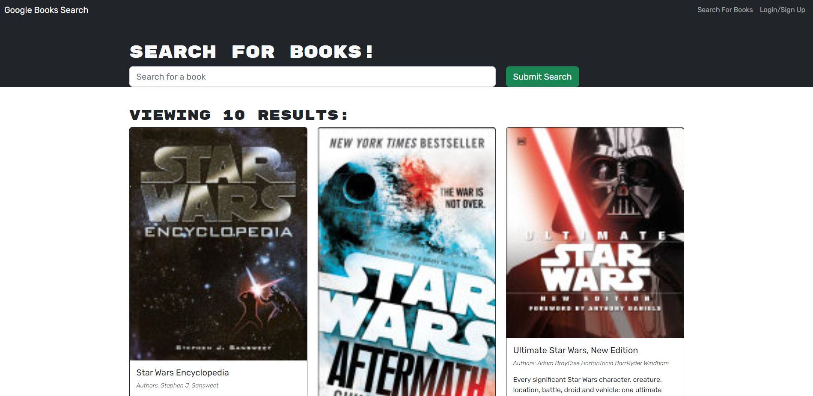

# Book Search Engine Starter Code

## Description:

### This is a book searching application that allow user to login, search books and save books using MERN.

## Table of Content

### \*[Installation](#installation)

### \*[Usage](#usage)

### \*[Credits](#credits)

### \*[License](#license)

### \*[Features](#features)

### \*[Contributors](#contributors)

### \*[Tests](#tests)

## Installation:

### N/A

## Usage:

### To use this application, user can search for books either login or not, but user can only save books after login, and user can click "Viewing saved books" to check their saved books. 

## Credits:

### N/A

## License: MIT 

### https://opensource.org/licenses/MIT

## Features:

### This application allow user to search books based on book title, save and remove saved books after login. To view the application please visit: https://mernbootcampbooksearcher.herokuapp.com/

## Contributors:

### N/A

## Tests:

### N/A

## Questions:

### Github: https://github.com/Haozhe-H/book-searcher
